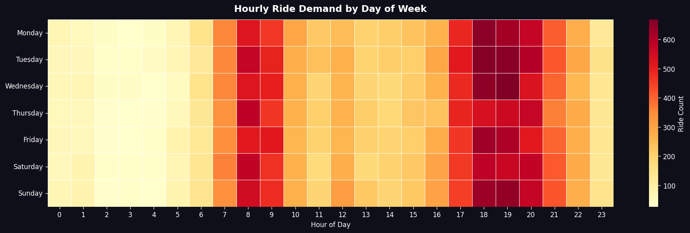
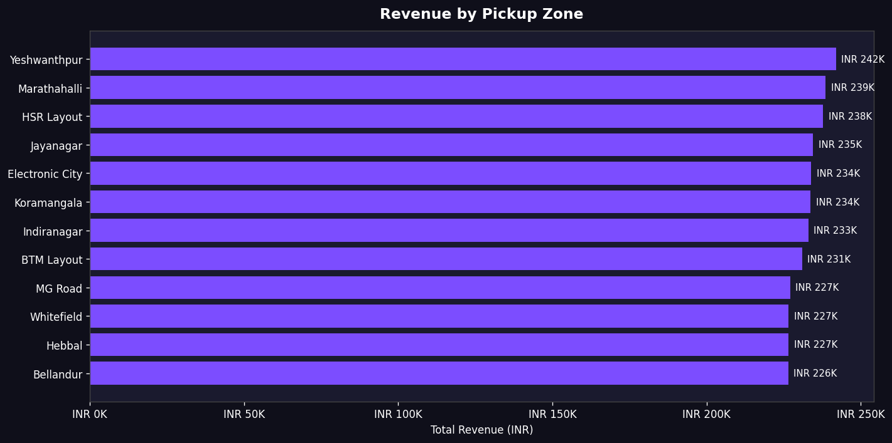
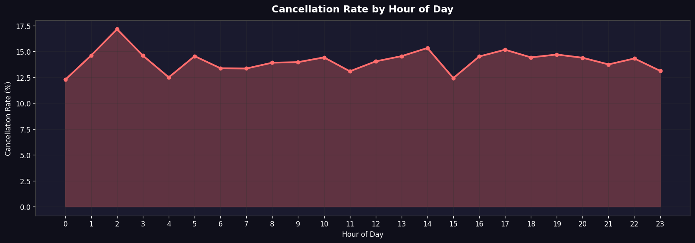
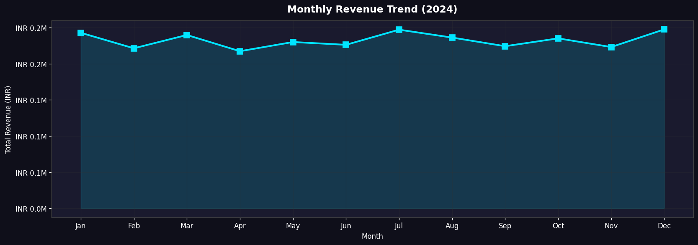

# Ride Demand Analysis

An analysis of ride-hailing demand patterns to optimize driver allocation and revenue, using Python, SQL, and pandas. The dataset used contains 50,000 simulated rides across 12 zones in Bangalore.

## Problem Context

Ride-hailing networks need to balance driver supply with passenger demand. This analysis attempts to:
- Identify peak demand windows and high-value zones
- Find cancellation patterns due to supply shortages
- Propose actionable business recommendations

## Tech Stack

- **Python**: pandas, numpy for processing and feature engineering
- **Visualization**: Matplotlib & Seaborn 
- **SQL Analysis**: SQLite 
- **Environment**: Jupyter Notebook

## Key Findings

- **Evening Rush (6–9 PM)**: This window sees roughly 2× more rides than other times.
- **Top Zones**: Koramangala & Whitefield generate the highest total revenue.
- **Cancellations**: A significant spike in cancellations occurs between 8–9 AM, indicating a supply-demand gap during the morning commute.
- **Payments**: UPI accounts for ~55% of all payments.
- **Pricing**: Weekend fares average about INR 12 higher than weekday fares.

## Dashboard Snapshots

Here are a few quick visual snapshots from the exploratory data analysis.






## Project Structure

```text
ride-demand-analysis/
├── data/
│   ├── raw/             # Generated by generate_data.py
│   └── processed/       # Output from clean_data.py
├── notebooks/
│   ├── 01_data_cleaning.ipynb
│   ├── 02_eda.ipynb
│   └── 03_sql_analysis.ipynb
├── scripts/
│   ├── generate_data.py
│   └── clean_data.py
├── sql/
│   └── analysis_queries.sql
├── charts/              # Saved visualizations
├── requirements.txt
└── README.md
```

## How to Run

1. Clone the project and install dependencies:
```bash
git clone https://github.com/YOUR_USERNAME/ride-demand-analysis.git
cd ride-demand-analysis
pip install -r requirements.txt
```

2. Generate and clean the data:
```bash
python scripts/generate_data.py
python scripts/clean_data.py
```

3. Launch Jupyter to view the notebooks:
```bash
jupyter notebook
```

## Recommendations

1. **Driver Allocation**: Consider incentivizing drivers in commercial zones during the 7–10 AM and 5–9 PM commute windows.
2. **Morning Incentives**: Additional earning bonuses before 7 AM could help address the 8-9 AM cancellation spike.
3. **Surge Pricing**: Implement or tweak route-based surge pricing on high-volume corridors during peak hours.

## Dataset Description

The analysis uses a synthesized dataset mimicking Bangalore's traffic patterns:
- 50,000 rides (Jan–Dec 2024)
- 5,000 drivers (Bike + Auto)
- 12 zones (Koramangala, Whitefield, Indiranagar, etc.)

## Author

**Ayush**
